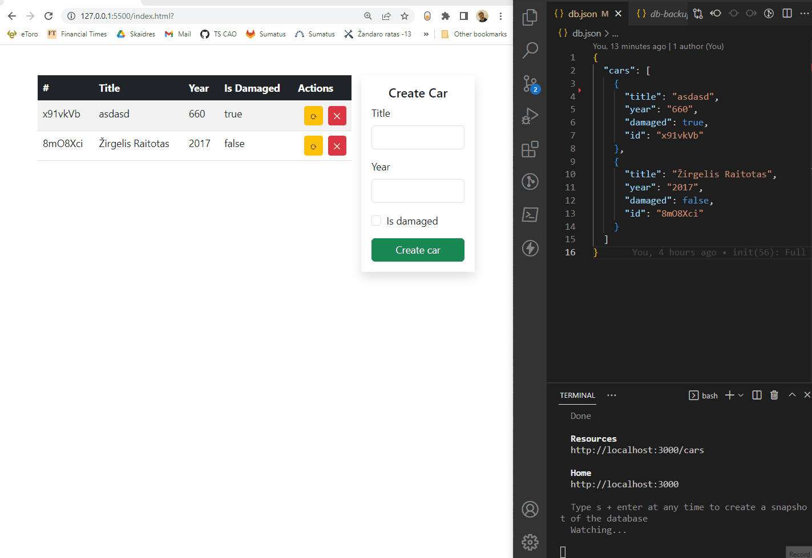

# Fullstack CRUD application

Program files are divided in two folders. Server and client folders. Server folder has it's own instructions in __readme.md__ file;

## Application example

## Requests examples
Requests examples can be viewed using [Postman](https://www.postman.com/downloads/). Request examples are given in [Postman File](./cars.postman_collection.json), which can you import in program.

## Code View

You can view code in Visual studio instance using [this link](https://github.dev/ZilvinasVidmantas/type-14/tree/main/JavaScript%20DOM%20%5B49-57%5D/57%20-%20FullStack%20CRUD%20app%20-%20consultation)