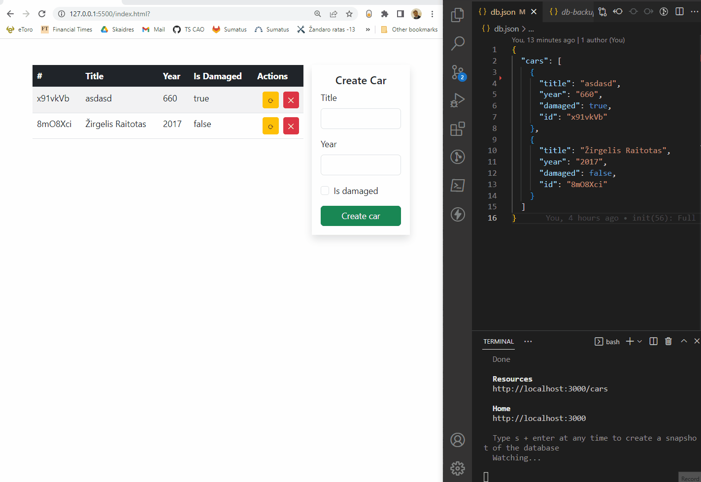

# Fullstack CRUD application

Program files are divided in thow folders. Server folder has it's own instructions in __readme.md__ file;

## Application example

## Requests examples
Request examples can be viewed using [Postman](https://www.postman.com/downloads/). Request examples are given in [Postman File](./cars.postman_collection.json)